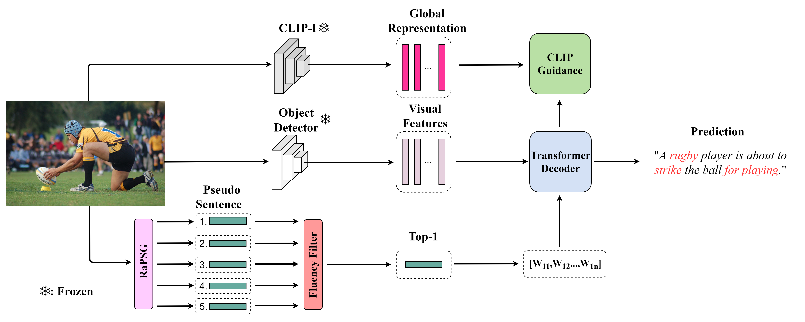

# Exploring Annotation-free Image Captioning with Retrieval-augmented Pseudo Sentence Generation (RaPSG)

This is the official Pytorch implementation of our paper: __Exploring Annotation-free Image Captioning with Retrieval-augmented Pseudo Sentence Generation__[[arXiv](https://arxiv.org)], Zhiyuan Li, Dongnan Liu, Heng Wang, Chaoyi Zhang, and Weidong (Tom) Cai. 

## Abstract
Training an image captioner without annotated image-sentence pairs has gained traction in recent years. Previous approaches can be categorized into two strategies: crawling sentences from mismatching corpora and aligning them with the given images as pseudo annotations, or pre-training the captioner using external image-text pairs. However, the aligning setting seems to reach its performance limit due to the quality problem of pairs, and pre-training requires significant computational resources. To address these challenges, we propose a new strategy "LPM + retrieval-augmented learning" where the prior knowledge from large pre-trained models (LPMs) is leveraged as supervision, and a retrieval process is integrated to further reinforce its effectiveness. Specifically, we introduce Retrieval-augmented Pseudo Sentence Generation (RaPSG), which adopts an efficient approach to retrieve highly relevant short region descriptions from the mismatching corpora and use them to generate a variety of pseudo sentences with distinct representations as well as high quality via LPMs. In addition, a fluency filter and a CLIP-guided training objective are further introduced to facilitate model optimization. Experimental results demonstrate that our method surpasses the SOTA pre-training model (Flamingo3B) by achieving a CIDEr score of 78.1 (+5.1) while utilizing only 0.3$\%$ of its trainable parameters (1.3B VS 33M). Importantly, our approach eliminates the need of computationally expensive pre-training processes on external datasets (e.g., the requirement of 312M image-text pairs for Flamingo3B). We further show that with a simple extension, the generated pseudo sentences can be deployed as weak supervision to boost the $1\%$ semi-supervised image caption benchmark up to 93.4 CIDEr score (+8.9) which showcases the versatility and effectiveness of our approach.



## Experiment setup
We provide an example running on the [DIFNet](https://github.com/mrwu-mac/DIFNet) (the best result version). If you want to try other captioner-based models ([M2](https://github.com/aimagelab/meshed-memory-transformer), [Xmodal-CTX](https://github.com/GT-RIPL/Xmodal-Ctx/tree/main), [DLCT](https://github.com/luo3300612/image-captioning-DLCT)), please follow their set up.

Clone the repository and create the `difnet` conda environment using the `environment.yml` file:
```
conda env create -f environment.yml
conda activate difnet
```

Then download spacy data by executing the following command:
```
python -m spacy download en
```

Add evaluation module from [evaluation](https://github.com/aimagelab/meshed-memory-transformer/tree/master/evaluation).

Note: Python 3.6+ and Pytorch 1.6+ are required to run our code. 

For more details, please refer to [DIFNet](https://github.com/mrwu-mac/DIFNet)

## Data preparation
### DIFNet part
To run the code, annotations and detection features for the COCO dataset are needed. Please download the annotations file [annotations.zip](https://drive.google.com/file/d/1i8mqKFKhqvBr8kEp3DbIh9-9UNAfKGmE/view?usp=sharing) and extract it.

Detection features are computed with the code provided by [grid-feats-vqa](https://github.com/facebookresearch/grid-feats-vqa). To reproduce our result, please extract the raw COCO grid features based on [grid-feats-vqa](https://github.com/facebookresearch/grid-feats-vqa) and process them according to [RSTNet](https://github.com/zhangxuying1004/RSTNet). You can also alternatively download the processed COCO grid features from [DLCT](https://github.com/luo3300612/image-captioning-DLCT).

Segmentation features are computed with the code provided by [UPSNet](https://github.com/uber-research/UPSNet). To reproduce our result, please download the segmentation features file [segmentations.zip](https://drive.google.com/file/d/1R7GL9FTZgc0cpCoJ6UGWNuhvAiDciab7/view?usp=sharing) (~83M) and extract it.

For more details, please refer to [DIFNet](https://github.com/mrwu-mac/DIFNet)

### Pseudo sentences generation
We recommend you directly download the prepared pseudo sentence for the code running [here](https://github.com/).

If you want to re-build the pseudo sentence by yourself, please follow the below steps:
#### Step 1:
Download the prepared region descriptions [here](https://github.com/). We follow the idea of Xmodal-ctx to generate the region descriptions. If you want to generate region descriptions by yourself, please follow up [CTX](https://github.com/GT-RIPL/Xmodal-Ctx/tree/main/ctx).
#### Step 2:
Use CLIP, BART-Xsum, and Sentence-Bert to generate four pseudo sentences (RaPSG module stage 1)  
```
python clip2sentence.py
```
#### Step 3:
Download the prediction sentences from frozen captioner [here](https://github.com/). You also need to download clip_feature [file](https://github.com/) If you want to get the prediction sentences by yourself, you can try to use four generated pseudo sentences in Step 2 to train the DIFNet and get the prediction sentences.

#### Step 4:
Use LLaMA-7B and the prediction sentences to generate the fifth pseudo sentence.
```
python lora_generate.py
```
After these four steps, we get the five pseudo sentences.

## Training
```
python train.py --mode difnet --setting no_anno
```
## Output
```bash
{BLEU : [0.7057666698578559, 0.4812259788649079, 0.3102759402066803, 0.19348772041165319]  METEOR : 0.21406017447362663  ROUGE : 0.4606356089131206  CIDEr : 0.7812562433169554  SPICE : 0.149468653248824}
```

# Semi-supervised setting
```
python train.py --mode difnet --setting semi
```
## Output
```bash
{BLEU : [0.7353274018650132, 0.5564645970737054, 0.3967128515231957, 0.27683646813002477]  METEOR : 0.2311046506771781  ROUGE : 0.5182142867406152  CIDEr : 0.9344287284363694  SPICE : 0.1665034571276323}
```

